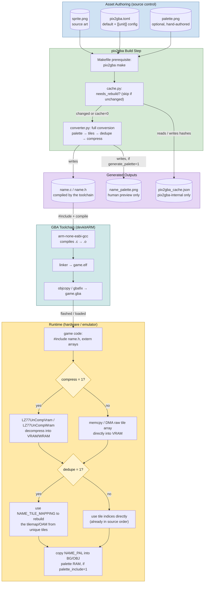

```mermaid
flowchart TD
    subgraph G1["Asset Authoring (source control)"]
        A1[("sprite.png<br/>source art")]
        A2[("pix2gba.toml<br/>default + [[unit]] config")]
        A3[("palette.png<br/>optional, hand-authored")]
    end

    subgraph G2["pix2gba Build Step"]
        B1["Makefile prerequisite:<br/>pix2gba make"]
        B1 --> B2["cache.py:<br/>needs_rebuild? (skip if unchanged)"]
        B2 -->|"changed or cache=0"| B3["converter.py: full conversion<br/>palette → tiles → dedupe → compress"]
    end

    A1 --> B1
    A2 --> B1
    A3 --> B1

    subgraph G3["Generated Outputs"]
        O1[("name.c / name.h<br/>compiled by the toolchain")]
        O2[("name_palette.png<br/>human preview only")]
        O3[("pix2gba_cache.json<br/>pix2gba-internal only")]
    end

    B3 -->|writes| O1
    B3 -->|writes, if generate_palette=1| O2
    B2 -->|reads / writes hashes| O3

    subgraph G4["GBA Toolchain (devkitARM)"]
        T1["arm-none-eabi-gcc<br/>compiles .c → .o"]
        T2["linker → game.elf"]
        T3["objcopy / gbafix → game.gba"]
        T1 --> T2 --> T3
    end

    O1 -->|"#include + compile"| T1

    subgraph G5["Runtime (hardware / emulator)"]
        R1["game code:<br/>#include name.h, extern arrays"]
        R2{"compress = 1?"}
        R3["LZ77UnCompVram / LZ77UnCompWram<br/>decompress into VRAM/WRAM"]
        R4["memcpy / DMA raw tile array<br/>directly into VRAM"]
        R5{"dedupe = 1?"}
        R6["use NAME_TILE_MAPPING to rebuild<br/>the tilemap/OAM from unique tiles"]
        R7["use tile indices directly<br/>(already in source order)"]
        R8["copy NAME_PAL into BG/OBJ<br/>palette RAM, if palette_include=1"]

        R1 --> R2
        R2 -->|yes| R3
        R2 -->|no| R4
        R3 --> R5
        R4 --> R5
        R5 -->|yes| R6
        R5 -->|no| R7
        R6 --> R8
        R7 --> R8
    end

    T3 -->|"flashed / loaded"| R1

    classDef decisionStyle fill:#fff3cd,stroke:#b8860b,color:#1a1a1a;
    class R2,R5 decisionStyle;

    style G1 fill:#cfe2f3,stroke:#4a7ba6,color:#1a1a1a
    style G2 fill:#d6ead6,stroke:#5a8f5a,color:#1a1a1a
    style G3 fill:#e6d6f5,stroke:#8a5cb8,color:#1a1a1a
    style G4 fill:#d0e8e8,stroke:#3d7a7a,color:#1a1a1a
    style G5 fill:#ffe9a8,stroke:#b8860b,color:#1a1a1a
```