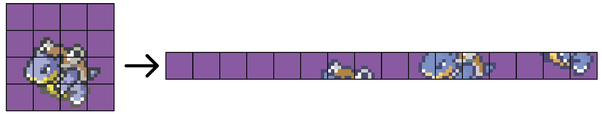

#  pix2gba 

A Python-based tool for converting standard image formats (PNG, JPEG) into GBA-compatible tile data, palettes, headers, and compression for use in GBA homebrew development.

## Introduction

`pix2gba` is a tile and palette converter designed for Game Boy Advance development. It is used to generate `.c` and `.h` files from images based on configuration stored in TOML files, with the option to compress the data. The tool supports multiple conversion units per project and is well-suited for automation or large asset pipelines.

This updated version uses a declarative configuration model (via `pix2gba.toml`) and can be run using simple system commands.

## Installation

1. Clone the repository:

```bash
git clone https://github.com/yourusername/pix2gba.git
cd pix2gba
```

2. Install the required dependencies:

```bash
pip install -r requirements.txt
```

3. Optionally, set it up as a CLI tool:

```bash
pip install -e .
```

## Usage

You can use `pix2gba` through the following commands:

```bash
pix2gba make      # convert assets
pix2gba clean     # removes generated files
pix2gba template  # (optional) to generate sample configs
pix2gba view Img  # View how the image will look on the GBA with the given setup
...
```

### Command Summary

| Command       | Description                                                           |
|---------------|-----------------------------------------------------------------------|
| `make`        | Converts all defined units in `pix2gba.toml`                          |
| `clean`       | Deletes all previously generated output files                         |
| `template`    | Generates an example `pix2gba.toml` in the project root               |
| `view` `name` | View how a unit will look on the GBA given the data in `pix2gba.toml` |
| `verify`      | Verifys all units in project can be inputted into GBA Hardware        |
| `byte` `name`  | Creates a binary file of the unit's converted data in the project root                   |


## TOML Configuration

### How to Set It Up

1. **Create a `pix2gba.toml` file** in each folder where your images are located.
2. Each TOML file defines conversion rules for that specific directory.
3. You can have multiple TOML files across your project to group image conversions logically.
4. When you run `pix2gba make` from the root directory, it will:
   - **Recursively search** all subdirectories for `pix2gba.toml` files
   - Apply conversion to every unit defined in each discovered TOML
5. Ensure the image filenames (without `.png`) match the `name` field in each `[[unit]]`.
6. The tool will generate output files (`.c`, `.h`, and optionally `.png`) in the specified `destination` directory.

**Example directory structure:**

```
project-root/
├── sprites/
│   ├── enemy.png
│   ├── player.png
│   └── pix2gba.toml
├── backgrounds/
│   ├── level1.png
│   ├── level2.png
│   └── pix2gba.toml
└── src/
    ├── main.c
    └── ...
```

Then, from `project-root`, simply run:

```bash
pix2gba make
```

All `pix2gba.toml` files in `sprites/`, `backgrounds/`, etc. will be discovered and processed.


The `pix2gba.toml` file defines the global settings and individual conversion units.

### Example

```toml
[graphics]
bpp = 4
transparent = "0x5D53"
output_type = "both"
destination = "./gfx"

[[unit]]
name = "sprite1"
metatile_width = 5
metatile_height = 5
palette = ""
palette_include = 1
generate_palettes = 1

[[unit]]
name = "sprite2"
metatile_width = 4
metatile_height = 4
palette = "root/pals/pal1.png"
palette_include = 0
generate_palettes = 0
```

### [graphics] section

| Key              | Type   | Description                                                         |
|------------------|--------|---------------------------------------------------------------------|
| `bpp`            | int    | Bits per pixel (4 or 8 typically)                                   |
| `transparent`    | str    | RGB15 hex value for transparent color (e.g., `"0x5D53"`)            |
| `output_type`    | str    | Output format: `"h"`, `"c"`, or `"both"`                            |
| `destination`    | path   | Output directory for generated files (relative to the project root) |

### [[unit]] section

Each `unit` represents a single image to convert.

| Key                | Type | Description                                                                   |
|--------------------|------|-------------------------------------------------------------------------------|
| `name`             | str  | Name of the image file (without `.png`)                                       |
| `metatile_width`   | int  | Number of 8x8 tiles per metatile width                                        |
| `metatile_height`  | int  | Number of 8x8 tiles per metatile height                                       |
| `palette`          | path | Path to a custom palette image or `""` to auto-generate                       |
| `palette_include`  | bool | Whether to embed the palette in the output (0 or 1)                           |
| `generate_palette` | bool | Whether to export a PNG file containing the used palette of the unit (0 or 1) |
| `compress`         | bool | Whether to compress the resulting tile data                                   |

## Features

- Converts standard images to GBA-compatible tile data
- Supports 4bpp and 8bpp modes
- Automatic or user-specified palettes
- Configurable metatile sizes
- Outputs `.h` and `.c` files
- PNG preview of the palette


## Output Format

- `.h` files include:
  - Tile length
  - Palette length
  - Extern declarations for tile and palette arrays
- `.c` files include:
  - Packed tile data in `unsigned int` arrays
  - Optional palette data in `unsigned short` arrays
  - Tiles are stored in a 1d stream (see figure below)
- `.png` preview of the palette (if enabled)



All output respects alignment and visibility attributes needed for GBA toolchains.


## Technical Concepts

### Bits Per Pixel (BPP)

BPP (Bits Per Pixel) determines how many bits are used to represent a single pixel in the image data. In the context of the GBA:

- **4 BPP** means each pixel can use 4 bits (0–15), allowing up to **16 colors** from a palette.
- **8 BPP** allows 8 bits per pixel (0–255), supporting **256 colors**.
- GBA tile rendering in 4bpp or 8bpp is handled differently in hardware; 4bpp is more memory-efficient but limited in color.

The `bpp` value also determines the size of the generated palette (`2^bpp`) and how tile data is packed into memory.

---

### Palettes

A **palette** is a set of predefined colors indexed by tile pixels. On the GBA:

- Each tile pixel does **not** store a color, only an index into a palette.
- Palettes are in **RGB15** format: 5 bits per channel (R, G, B), packed into 16-bit values.
- Palette entry 0 is typically used for transparency. The tool supports setting a specific transparent color via the `transparent` key in the TOML.
- You can either:
  - Auto-generate a palette from the input image, selecting the most common colors.
  - Provide your own palette image (each pixel = 1 color).

The output `.c` and `.h` files will include this palette data if `palette_include = 1`.

---

### Tiles

- Tiles are **8x8 pixel** squares – the basic unit of GBA graphics.
- Each tile is encoded as an array of pixel indices into the palette (not raw colors).
- Tiles are used across:
  - **Background layers** (BG0–BG3)
  - **Sprites (OBJs)**

Tile data is tightly packed and aligned in VRAM, and can be stored in different formats based on the BPP.

---

### Metatiles

A **metatile** is a logical grouping of smaller 8x8 tiles into a larger structure, like:

- **2x2 tiles = 16x16 metatile**
- **4x3 tiles = 32x24 metatile**

Why use metatiles?

- **Level design**: Backgrounds often reuse larger blocks to build maps (e.g., a corner, a wall).
- **Efficiency**: Reduces complexity in tilemaps, and helps with memory reuse.
- **Abstraction**: Designers can work at a higher level (e.g., tilemap of metatiles) instead of managing thousands of individual tiles.

The tool generates data based on your metatile size settings (`metatile_width`, `metatile_height`), and pads your images as necessary to match these dimensions.

---

### Compression

The Game Boy Advance includes a hardware-assisted LZ77 decompressor in its BIOS, making LZ77 the standard compression format for game assets. `pix2gb` can optionally compress tile data using this format to significantly reduce ROM size.

When compression is enabled:

- Tile data is compressed after it has been converted into GBA tile layout and bit-packed format (4bpp or 8bpp).

- The output `.c` file will contain the compressed byte stream instead of raw tile words.

- The `.h` file will expose the compressed size and symbol name so the game can decompress it at runtime.

On the GBA, the data is decompressed using:

```bash
# If destination is in Vram
LZ77UnCompVram(compressedTiles, destinationInVRAM);

# If destination is in Wram
LZ77UnCompWram(compressedTiles, destinationInWRAM);
```

---

## Troubleshooting

Common issues and how to address them:

- **Image not found**: Ensure the `.png` file exists and is named correctly (no extension in the TOML).
- **Palette not found**: If a palette is specified, it must also be a `.png` file.
- **Invalid BPP**: Only values like `4` or `8` (powers of two) are accepted.
- **Transparent color invalid**: Must be a valid RGB15 hex (e.g., `0x1F1F`) and below `0x7FFF`.
- **Output directory errors**: Make sure the `destination` path exists and is a directory.
- **Padding or alignment issues**: Images that don’t align with metatile sizes will be automatically padded.
- **No output generated**: Ensure you’re in the correct directory and that your TOML file is named `pix2gba.toml`.

## License

This project is licensed under the MIT License.
