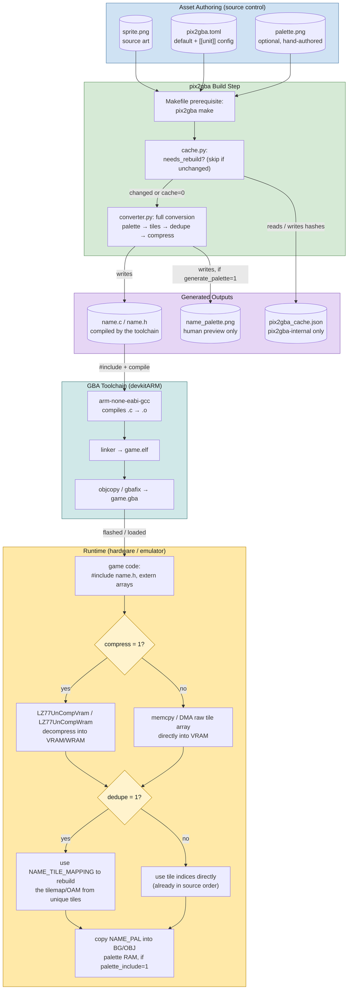
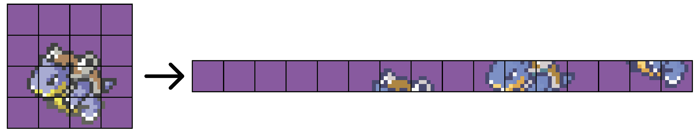

<p align="center">
  
</p>

<h1 align="center">pix2gba</h1>

<p align="center">
  <strong>Turn PNGs into Game Boy Advance tiles, palettes, and C headers with one command.</strong>
</p>

<p align="center">
  
  
  
  
  <a href="https://github.com/MichShep/pix2gba/issues"></a>
</p>

---

**pix2gba** is a command-line asset converter for **Game Boy Advance homebrew developers**. You describe your art in a small `pix2gba.toml` file and run `pix2gba make`. You get `.c` / `.h` files with packed tile data, RGB15 palettes, and optional LZ77 compression and tile deduplication, ready to `#include` and compile with devkitARM.

**Why it exists:** GBA art has to be sliced into 8×8 tiles, reduced to a 16- or 256-color palette, and bit-packed. Doing that by hand for every image doesn't scale, and one-off converter flags are easy to lose track of. pix2gba keeps the conversion rules **declarative and version-controlled** next to your art. It **caches** results so unchanged assets are skipped, which makes it safe to run as a Makefile prerequisite on every build.

<p align="center">
  
</p>

## Table of Contents

- [Quickstart](#quickstart)
- [Features](#features)
- [Architecture](#architecture)
- [Usage](#usage)
  - [Commands](#commands)
  - [Configuring units (`pix2gba.toml`)](#configuring-units-pix2gbatoml)
  - [Using the output in your game](#using-the-output-in-your-game)
- [Feature deep dive: metatiles](#feature-deep-dive-metatiles)
- [GBA concepts primer](#gba-concepts-primer)
- [FAQ](#faq)
- [Contributing](#contributing)
- [Resources & acknowledgements](#resources--acknowledgements)

## Quickstart

**Requirements:** Python 3.9+ on macOS, Linux, or Windows.

**1. Clone and install**

```bash
git clone https://github.com/MichShep/pix2gba.git
cd pix2gba
python3 -m venv .venv && source .venv/bin/activate
pip install -r requirements.txt
pip install -e .
```

`pip install -e .` registers the `pix2gba` command on your `PATH`.

**2. Check the install**

```bash
pix2gba help
```

**3. Convert the bundled examples**

```bash
pix2gba make
```

Run this from the repo root. pix2gba finds `examples/ui/pix2gba.toml` and `examples/entities/pix2gba.toml`, converts their sprites, and writes the results to `examples/output/`. One unit, `Sprite7`, points at a palette that doesn't exist **on purpose**, so you can see what a failed unit looks like in the summary.

**4. Preview a sprite as the GBA will draw it**

```bash
pix2gba view Sprite6
```

## Features

| Feature | What it does for you |
|---|---|
| **Declarative TOML config** | Each folder of art gets a `pix2gba.toml` with a `[default]` block and one `[[unit]]` per image. Units inherit every default and override only what they need. |
| **Recursive discovery** | `pix2gba make` searches every subdirectory (including nested ones) for `pix2gba.toml` files, so one command builds the whole project. |
| **4bpp & 8bpp tiles** | Packs pixels into 16-color (4bpp) or 256-color (8bpp) 8×8 tiles in GBA VRAM layout, stored as `unsigned int` arrays. |
| **Automatic or hand-authored palettes** | Builds a palette from the image's most-used colors, or reads one from a palette image where each pixel is one color. The `transparent` color is always placed at index 0. |
| **Metatile ordering** | Emits tiles grouped into N×M blocks, which is the order the GBA expects for multi-tile sprites. See the [deep dive](#feature-deep-dive-metatiles). |
| **Tile deduplication** | Stores each unique 8×8 tile once and generates a `NAME_TILE_MAPPING` array to rebuild the original layout. |
| **LZ77 compression** | Compresses tile data in the format the GBA BIOS decompresses (`LZ77UnCompVram` / `LZ77UnCompWram`), in pure Python with no compiler or native library needed. |
| **Content-hash caching** | Skips units whose image, palette, and settings haven't changed, so `make` stays fast enough to run on every build. |
| **Size report in every header** | Each `.h` starts with a comment block listing dimensions, tile count, byte size, and the % saved by dedupe and compression. |
| **Live preview** | `pix2gba view` opens a window that renders the converted tiles with the converted palette, scaled up 8×. |
| **Validation** | `pix2gba verify` checks paths, bpp, colors, and metatile sizes for every unit without writing any files. |

## Architecture

The diagram shows where pix2gba sits in a GBA project: from source art under version control, through the cached build step and the devkitARM toolchain, to how the generated arrays are used at runtime.



For a module-level view of each command (`make`, `clean`, `verify`, `view`), see the per-command flowcharts in [SequenceDiagram.md](SequenceDiagram.md). The source for the diagram above is in [AssetPipeline.md](AssetPipeline.md).

## Usage

### Commands

Run every command from your **project root**. pix2gba searches downward from the current directory.

| Command | Description |
|---|---|
| `pix2gba make` | Convert every unit in every `pix2gba.toml` found under the current directory, skipping units that are cached and unchanged. |
| `pix2gba clean` | Delete the generated `.c`, `.h`, and `_palette.png` files and every `pix2gba_cache.json`. |
| `pix2gba verify` | Validate every unit (paths, bpp, output type, transparent color, metatile size) without converting anything. |
| `pix2gba view <unit>` | Open a preview window showing the unit as the GBA will render it. |
| `pix2gba byte <unit>` | Write the unit's raw, uncompressed tile data to `<unit>_bytes.bin` in the current directory (little-endian u32 words). |
| `pix2gba template` | Write a starter config to `pix2gba_template.toml` in the current directory. Rename it to `pix2gba.toml` and move it next to your images. |
| `pix2gba help` | Show command help. |

By default pix2gba prints only warnings, errors, and the final summary. Add `--verbose` to any command (`pix2gba make --verbose`) to see every step, including validation, cache hits, and dedupe/compression results.

### Configuring units (`pix2gba.toml`)

Put a `pix2gba.toml` in each folder of images. A typical layout:

```
project-root/
├── sprites/
│   ├── enemy.png
│   ├── player.png
│   └── pix2gba.toml
├── backgrounds/
│   ├── level1.png
│   └── pix2gba.toml
├── gfx/                  ← destination (must already exist)
└── src/
    └── main.c
```

Each file has **one `[default]` block that must list every key**, plus one `[[unit]]` per image. A unit's `name` is the image filename without `.png`, and the image must sit in the same folder as the TOML. Every key except `name` can be left out of a unit to inherit the default.

```toml
# sprites/pix2gba.toml
[default]
bpp = 4
transparent = "0x5D53"      # RGB15; always placed at palette index 0
output_type = "both"
destination = "../gfx"      # relative to this pix2gba.toml
name = ""
metatile_width = 1
metatile_height = 1
palette = ""                # "" = generate from the image
palette_include = 0
generate_palette = 0
compress = 0
dedupe = 0
cache = 1

[[unit]]
name = "player"             # → sprites/player.png
metatile_width = 2
metatile_height = 4         # 16×32 px sprite
palette_include = 1
compress = 1

[[unit]]
name = "enemy"
palette = "./shared_palette.png"
dedupe = 1
```

#### Configuration keys

| Key | Type | Description |
|---|---|---|
| `name` | str | Image filename without `.png`. **Required on every unit.** Also used as the prefix for C symbol names. |
| `bpp` | int | Bits per pixel: `4` (16 colors) or `8` (256 colors). |
| `transparent` | str | RGB15 hex color placed at palette index 0, e.g. `"0x5D53"`. Max `0x7FFF`. |
| `output_type` | str | `"c"`, `"h"`, or `"both"`. |
| `destination` | path | Output directory. It must already exist, and relative paths resolve against the directory containing the pix2gba.toml. |
| `metatile_width` | int | Width of a metatile in 8×8 tiles (≥ 1). |
| `metatile_height` | int | Height of a metatile in 8×8 tiles (≥ 1). |
| `palette` | path | Palette image (one pixel = one color, at most 2^bpp pixels), or `""` to generate the palette from the image. |
| `palette_include` | 0/1 | Emit `NAME_PAL` / `NAME_PAL_LEN` in the output. |
| `generate_palette` | 0/1 | Also write `NAME_palette.png`, a preview image of the palette in use. |
| `compress` | 0/1 | LZ77-compress the tile data (emits `NAME_COMPRESSION` instead of `NAME_TILES`). |
| `dedupe` | 0/1 | Remove duplicate tiles and emit `NAME_TILE_MAPPING`. |
| `cache` | 0/1 | Skip the unit when nothing has changed. With `0`, the unit is rebuilt on every `make`. |

See how easy it is so make changes to assets and view the changes!
<p align="center">
  
</p>


### Using the output in your game

Given the unit `player` above, pix2gba writes `gfx/player.h` and `gfx/player.c`. The header starts with a summary block like this one, taken from the bundled `examples/output/Sprite6.h`:

```c
// Sprite6; on palette Sprite6_palette.png
#pragma once

//======================================================================
//	Sprite6, 64pxl by 32pxl @ 4bpp
//	+ Number of Tiles : 32
//	+ Metatile Shape  : 4w by 4h
//	+ Dimensions in MT: 2w by 1h
//	+ Number of Bytes : 1024
//	+ Number of U32   : 256
//	+ Blank Color     : 0x5d53
//======================================================================

#define Sprite6_TILE_COUNT 32
#define Sprite6_TILE_BYTES 1024
extern const unsigned int Sprite6_TILES[256];
```

Which symbols you get depends on the unit's flags:

| Symbol | Type | Emitted when |
|---|---|---|
| `NAME_TILE_COUNT`, `NAME_TILE_BYTES` | `#define` | always (the count is of unique tiles when deduped) |
| `NAME_TILES[]` | `const unsigned int` | `compress = 0` |
| `NAME_COMPRESSION[]`, `NAME_COMPRESSION_BYTES` | `const unsigned char`, `#define` | `compress = 1` |
| `NAME_TILE_MAPPING[]`, `NAME_TILE_MAPPING_LENGTH` | `const unsigned short`, `#define` | `dedupe = 1` |
| `NAME_PAL[]`, `NAME_PAL_LEN` (bytes) | `const unsigned short`, `#define` | `palette_include = 1` |

Loading it at runtime (this example uses [libtonc](https://www.coranac.com/tonc/text/) helpers; any VRAM copy routine works):

```c
#include <tonc.h>
#include "player.h"

// Uncompressed: copy tiles straight into OBJ VRAM
memcpy32(&tile_mem[4][0], player_TILES, player_TILE_BYTES / 4);

// Compressed (compress = 1): the BIOS decompresses into VRAM for you
LZ77UnCompVram(player_COMPRESSION, &tile_mem[4][0]);

// Palette (palette_include = 1)
memcpy16(pal_obj_mem, player_PAL, player_PAL_LEN / 2);
```

With `dedupe = 1`, the tile data holds only unique tiles. Entry `i` of `NAME_TILE_MAPPING` gives the unique-tile index to draw at the `i`-th tile position, in the same metatile order the tiles were emitted in. If compression is also on, only the tile data is compressed; the mapping stays uncompressed.

## Feature deep dive: metatiles

The GBA doesn't draw an image; it draws a list of 8×8 tiles. A 32×32 sprite is 16 tiles, and in 1D sprite mapping the hardware reads them **in order from VRAM**. The tile order in your data must match the shape of the object that will display it.

`metatile_width` and `metatile_height` set that shape in tiles. pix2gba walks the image **one metatile at a time**, left to right and top to bottom. Inside each metatile it emits tiles row by row. With a 4×4 metatile, a 32×32 sprite becomes 16 consecutive tiles that a 32×32 OBJ can use directly:

<p align="center">
  
</p>

Common settings:

| Use case | `metatile_width × metatile_height` |
|---|---|
| Backgrounds / tilesets (plain row-major tiles) | `1 × 1` |
| 16×16 sprite frames | `2 × 2` |
| 16×32 character sprite | `2 × 4` |
| 32×32 sprite frames in a sprite sheet | `4 × 4` |

For a sprite sheet, set the metatile size to **one frame**. Every frame then lands in VRAM as a contiguous block, and animating is a matter of changing the OBJ's base tile index. The `view` command renders in this same order, so you can check the layout before it reaches hardware.

## GBA concepts primer

<details>
<summary><strong>Bits per pixel (4bpp vs 8bpp)</strong></summary>

Each pixel stores a palette **index**, not a color. At 4bpp an index is 0–15 (16 colors, 32 bytes per tile). At 8bpp it's 0–255 (256 colors, 64 bytes per tile). 4bpp uses half the memory and is the usual choice for sprites.
</details>

<details>
<summary><strong>Palettes & RGB15</strong></summary>

GBA colors are 15-bit: 5 bits each for red, green, and blue, packed as `0bbbbbgggggrrrrr`. pix2gba converts 24-bit PNG colors down to RGB15 and maps each pixel to the **nearest** palette entry. Palette index 0 is transparent on the GBA, so pix2gba always puts your `transparent` color there.
</details>

<details>
<summary><strong>Deduplication</strong></summary>

Flat or repeating areas (sky, walls, empty sprite corners) produce many identical 8×8 tiles. Dedupe stores each unique tile once and records a mapping. The GBA already draws by tile index, so this costs nothing at runtime and can shrink backgrounds significantly. The header's "Saved Size" line reports the exact savings.
</details>

<details>
<summary><strong>LZ77 compression</strong></summary>

The GBA BIOS has built-in LZ77 decompression (`LZ77UnCompVram` / `LZ77UnCompWram`), which makes it the standard way to save ROM space on graphics. pix2gba compresses the final tile stream, after dedupe if that's on.
</details>

<details>
<summary><strong>How the cache works</strong></summary>

Each folder with a `pix2gba.toml` gets a `pix2gba_cache.json` that stores SHA-256 hashes of:

- the `[default]` block (if it changes, every unit in that file rebuilds),
- each unit's settings (every key except `name` and `cache`),
- the image's pixel data,
- the palette image's pixel data (if one is used),
- the pix2gba cache version.

A unit rebuilds when any of its hashes change. `pix2gba clean` deletes the cache files.
</details>

## FAQ

<details>
<summary><strong>I get <code>Output directory does not exist</code>, but the folder is right next to my TOML.</strong></summary>

`destination` and `palette` paths resolve against the directory you **run pix2gba from**, not the TOML's folder. Only the image (`name`) is looked up next to the TOML. Write these paths relative to your project root and always run pix2gba from there. pix2gba also doesn't create output folders, so create `destination` first.
</details>

<details>
<summary><strong>What happens if my image isn't a multiple of the metatile size?</strong></summary>

pix2gba pads the right and bottom edges out to whole metatiles (`metatile_width × 8` by `metatile_height × 8` pixels) and fills the padding with palette index 0, the transparent color. For example, a 21×13 image with 2×2 metatiles becomes 32×16. The header shows the padded size, e.g. `21pxl by 13pxl @ 4bpp (padded to 32pxl by 16pxl)`, and `NAME_TILE_COUNT` includes the padding tiles.
</details>

<details>
<summary><strong>The colors in <code>view</code> don't match my art.</strong></summary>

If your image has more than 2^bpp colors, the generated palette keeps the **most frequently used** ones and maps every other color to the nearest match. Reduce the art to 16 (or 256) colors yourself, or supply a hand-made `palette` image. `generate_palette = 1` writes a PNG of the palette that was actually used, which helps with debugging.
</details>

<details>
<summary><strong>Can I convert JPEGs or other formats?</strong></summary>

Not currently. Each unit resolves to `<name>.png` in the TOML's folder. Export or convert your art to PNG first.
</details>

<details>
<summary><strong>A <code>pix2gba.toml</code> isn't being picked up.</strong></summary>

pix2gba searches every folder below the one you run it from, including folders nested inside other TOML folders (`sprites/` and `sprites/enemies/` can each have their own TOML). It skips **hidden folders** whose names start with `.`, such as `.git` and `.venv`. Make sure your art isn't in one of those, and that you're running the command from a folder above it.
</details>

<details>
<summary><strong>Why doesn't <code>view</code> or <code>byte</code> reflect dedupe or compression?</strong></summary>

Both commands run a "simulated" conversion that always skips dedupe and compression. `view` shows how the image will look on screen, and `byte` dumps the plain tile layout. Use `make` for the final data.
</details>

<details>
<summary><strong>How do I run pix2gba automatically from my Makefile?</strong></summary>

Run it before compiling. The cache makes repeated runs cheap:

```make
assets:
	pix2gba make

$(TARGET).elf: assets $(OFILES)
```
</details>

## Contributing

Bug reports and pull requests are welcome.


## Resources & acknowledgements

- **Docs in this repo:** [Asset pipeline diagram](AssetPipeline.md) · [Per-command flowcharts](SequenceDiagram.md) · [Examples](../examples)
- **Issue tracker:** [github.com/MichShep/pix2gba/issues](https://github.com/MichShep/pix2gba/issues)
- **GBA development references:** [Tonc](https://www.coranac.com/tonc/text/) (tiles, sprites, BIOS calls) · [GBATEK](https://problemkaputt.de/gbatek.htm) (hardware and BIOS decompression formats) · [devkitPro](https://devkitpro.org/) (toolchain)
- **Built with:** [Pillow](https://python-pillow.org/), [NumPy](https://numpy.org/), [PySide6](https://doc.qt.io/qtforpython-6/), and [toml](https://pypi.org/project/toml/)
