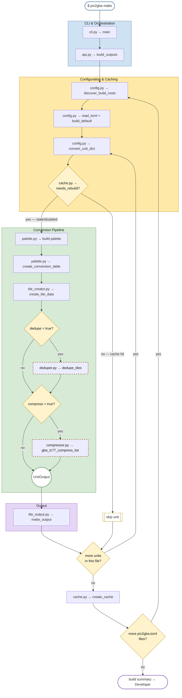
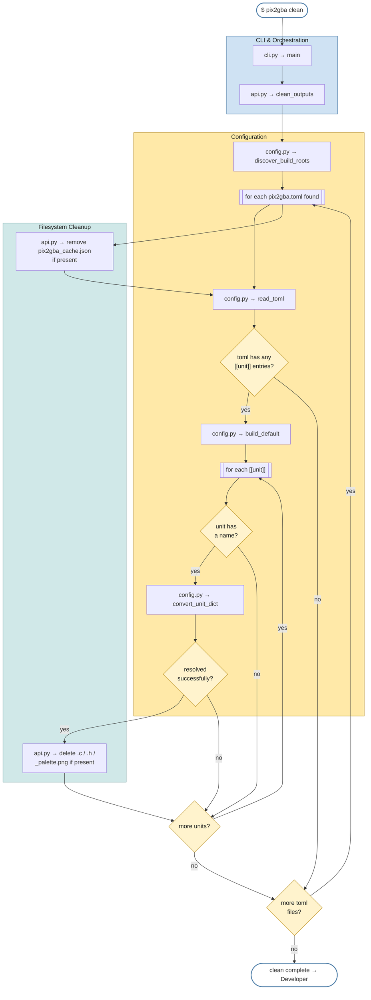
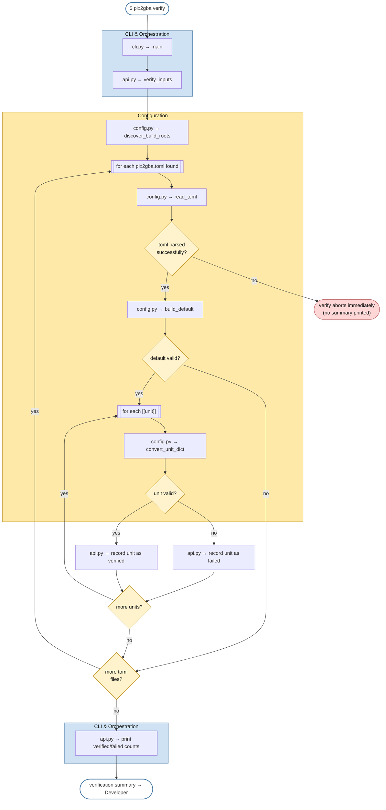
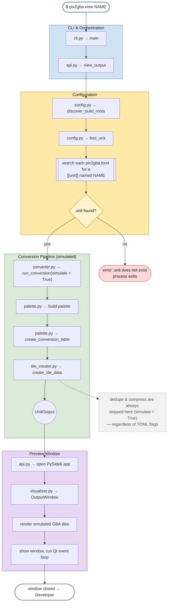

## make

```mermaid
flowchart TD
    Dev(["$ pix2gba make"]) --> M1[cli.py → main]

    subgraph G1["CLI & Orchestration"]
        M1 --> M2[api.py → build_outputs]
    end

    M2 --> D1

    subgraph G2["Configuration & Caching"]
        D1[config.py → discover_build_roots] --> D2[config.py → read_toml + build_default]
        D2 --> D3[config.py → convert_unit_dict]
        D3 --> D4{cache.py →<br/>needs_rebuild?}
    end

    D4 -->|"no — cache hit"| SK[["skip unit"]]
    D4 -->|"yes — stale/disabled"| P1

    subgraph G3["Conversion Pipeline"]
        P1[palette.py → build palette] --> P2[palette.py → create_conversion_table]
        P2 --> P3[tile_creator.py → create_tile_data]
        P3 --> P4{dedupe = true?}
        P4 -->|yes| P5[deduper.py → dedupe_tiles]:::optional
        P4 -->|no| P6{compress = true?}
        P5 --> P6
        P6 -->|yes| P7[compressor.py → gba_lz77_compress_list]:::optional
        P6 -->|no| P8((UnitOutput))
        P7 --> P8
    end

    subgraph G5["Output"]
        O1[tile_output.py → make_output]
    end
    P8 --> O1

    O1 --> D5{more units<br/>in this file?}
    SK --> D5
    D5 -->|yes| D3
    D5 -->|no| C1[cache.py → create_cache]

    C1 --> D6{more pix2gba.toml<br/>files?}
    D6 -->|yes| D1
    D6 -->|no| Fin(["build summary → Developer"])

    classDef optional stroke-dasharray: 5 5,stroke:#9a5323,stroke-width:2px,color:#1a1a1a;
    classDef decisionStyle fill:#fff3cd,stroke:#b8860b,color:#1a1a1a;
    class D4,P4,P6,D5,D6 decisionStyle;

    style G1 fill:#cfe2f3,stroke:#4a7ba6,color:#1a1a1a
    style G2 fill:#ffe9a8,stroke:#b8860b,color:#1a1a1a
    style G3 fill:#d6ead6,stroke:#5a8f5a,color:#1a1a1a
    style G5 fill:#e6d6f5,stroke:#8a5cb8,color:#1a1a1a
    style Dev fill:#ffffff,stroke:#4a7ba6,stroke-width:2px
    style Fin fill:#ffffff,stroke:#8a5cb8,stroke-width:2px
    style P8 fill:#ffffff,stroke:#5a8f5a,stroke-width:2px
    style SK fill:#ffffff,stroke:#b8860b
```

## clean

```mermaid
flowchart TD
    Dev(["$ pix2gba clean"]) --> M1[cli.py → main]

    subgraph G1["CLI & Orchestration"]
        M1 --> M2[api.py → clean_outputs]
    end

    M2 --> D1

    subgraph G2["Configuration"]
        D1[config.py → discover_build_roots] --> LT[["for each pix2gba.toml found"]]
        LT --> RT[config.py → read_toml]
        RT --> HU{"toml has any<br/>[[unit]] entries?"}
        HU -->|yes| BD[config.py → build_default]
        BD --> LU[["for each [[unit]]"]]
        LU --> HN{"unit has<br/>a name?"}
        HN -->|yes| CU[config.py → convert_unit_dict]
        CU --> VA{"resolved<br/>successfully?"}
    end

    LT --> RM

    subgraph G3["Filesystem Cleanup"]
        RM["api.py → remove pix2gba_cache.json<br/>if present"]
        DEL["api.py → delete .c / .h /<br/>_palette.png if present"]
    end

    RM --> RT
    VA -->|yes| DEL
    DEL --> NU{"more units?"}
    HN -->|no| NU
    VA -->|no| NU
    HU -->|no| NT{"more toml<br/>files?"}
    NU -->|yes| LU
    NU -->|no| NT
    NT -->|yes| LT
    NT -->|no| Fin(["clean complete → Developer"])

    classDef decisionStyle fill:#fff3cd,stroke:#b8860b,color:#1a1a1a;
    class HU,HN,VA,NU,NT decisionStyle;

    style G1 fill:#cfe2f3,stroke:#4a7ba6,color:#1a1a1a
    style G2 fill:#ffe9a8,stroke:#b8860b,color:#1a1a1a
    style G3 fill:#d0e8e8,stroke:#3d7a7a,color:#1a1a1a
    style Dev fill:#ffffff,stroke:#4a7ba6,stroke-width:2px
    style Fin fill:#ffffff,stroke:#4a7ba6,stroke-width:2px
```

## verify

```mermaid
flowchart TD
    Dev(["$ pix2gba verify"]) --> M1[cli.py → main]

    subgraph G1["CLI & Orchestration"]
        M1 --> M2[api.py → verify_inputs]
    end

    M2 --> D1

    subgraph G2["Configuration"]
        D1[config.py → discover_build_roots] --> LT[["for each pix2gba.toml found"]]
        LT --> RT[config.py → read_toml]
        RT --> TO{"toml parsed<br/>successfully?"}
        TO -->|yes| BD[config.py → build_default]
        BD --> DO{"default valid?"}
        DO -->|yes| LU[["for each [[unit]]"]]
        LU --> CU[config.py → convert_unit_dict]
        CU --> VA{"unit valid?"}
    end

    TO -->|no| AB(["verify aborts immediately<br/>(no summary printed)"])

    VA -->|no| RF["api.py → record unit as failed"]
    VA -->|yes| RO["api.py → record unit as verified"]
    RF --> NU{"more units?"}
    RO --> NU
    DO -->|no| NT{"more toml<br/>files?"}
    NU -->|yes| LU
    NU -->|no| NT
    NT -->|yes| LT
    NT -->|no| SM

    subgraph G1b["CLI & Orchestration"]
        SM["api.py → print verified/failed counts"]
    end

    SM --> Fin(["verification summary → Developer"])

    classDef decisionStyle fill:#fff3cd,stroke:#b8860b,color:#1a1a1a;
    class TO,DO,VA,NU,NT decisionStyle;
    classDef warnNode fill:#ffd6d6,stroke:#b85c5c,color:#1a1a1a;
    class AB warnNode;

    style G1 fill:#cfe2f3,stroke:#4a7ba6,color:#1a1a1a
    style G1b fill:#cfe2f3,stroke:#4a7ba6,color:#1a1a1a
    style G2 fill:#ffe9a8,stroke:#b8860b,color:#1a1a1a
    style Dev fill:#ffffff,stroke:#4a7ba6,stroke-width:2px
    style Fin fill:#ffffff,stroke:#4a7ba6,stroke-width:2px
```

## view

```mermaid
flowchart TD
    Dev(["$ pix2gba view NAME"]) --> M1[cli.py → main]

    subgraph G1["CLI & Orchestration"]
        M1 --> M2[api.py → view_output]
    end

    M2 --> D1

    subgraph G2["Configuration"]
        D1[config.py → discover_build_roots] --> D2[config.py → find_unit]
        D2 --> LT[["search each pix2gba.toml for a<br/>[[unit]] named NAME"]]
        LT --> FD{"unit found?"}
    end

    FD -->|no| AB(["error: unit does not exist<br/>process exits"])
    FD -->|yes| RC["converter.py → run_conversion(simulate = True)"]

    subgraph G3["Conversion Pipeline (simulated)"]
        RC --> P1[palette.py → build palette]
        P1 --> P2[palette.py → create_conversion_table]
        P2 --> P3[tile_creator.py → create_tile_data]
        P3 --> P8((UnitOutput))
    end

    P3 -.-> NOTE["dedupe & compress are always<br/>skipped here (simulate = True)<br/>— regardless of TOML flags"]

    P8 --> VW[api.py → open PySide6 app]

    subgraph G5["Preview Window"]
        VW --> OW[visualizer.py → OutputWindow]
        OW --> RD[render simulated GBA tiles]
        RD --> SH["show window, run Qt event loop"]
    end

    SH --> Fin(["window closed → Developer"])

    classDef decisionStyle fill:#fff3cd,stroke:#b8860b,color:#1a1a1a;
    class FD decisionStyle;
    classDef warnNode fill:#ffd6d6,stroke:#b85c5c,color:#1a1a1a;
    class AB warnNode;
    classDef noteNode fill:#f0f0f0,stroke:#999999,stroke-dasharray: 3 3,color:#555555;
    class NOTE noteNode;

    style G1 fill:#cfe2f3,stroke:#4a7ba6,color:#1a1a1a
    style G2 fill:#ffe9a8,stroke:#b8860b,color:#1a1a1a
    style G3 fill:#d6ead6,stroke:#5a8f5a,color:#1a1a1a
    style G5 fill:#e6d6f5,stroke:#8a5cb8,color:#1a1a1a
    style Dev fill:#ffffff,stroke:#4a7ba6,stroke-width:2px
    style Fin fill:#ffffff,stroke:#8a5cb8,stroke-width:2px
```